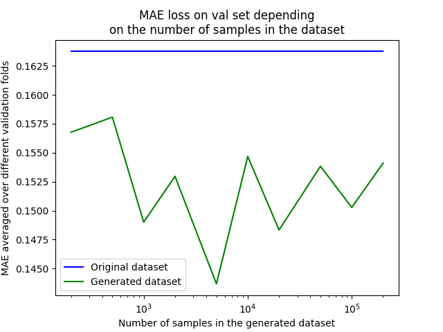

# Interview tasks - ML Engineer

This is a project that represents my solution 
to the tasks described in assignment.pdf.
## Table of Contents

- [Installation](#installation)
- [Task 1](#task-1)
- [Task 2](#task-2)
- [Task 3](#task-3)
- [Task 4](#task-4)

---
## Installation

It is asserted that the environment has a working docker 
already installed.

To make it easier to run training, dataset generation and 
ablation study, I have created another Dockerfile 
for that.

To build the image run:
```
docker build -t training -f dockerfiles/Dockerfile .
```

## Task 1
Solution to this task is in the [train.py](train.py) file. 
To train the model run:
```
docker run --rm -u $(id -u):$(id -g) -v $(pwd):/mnt/code -it training python train.py --version 1
```
The result of this task is a trained model, saved in the 
SavedModel format in the folder: `./checkpoints/1`

## Task 2
The Docker image is described in 
[dockerfiles/Dockerfile.task2](dockerfiles/Dockerfile.task2). 

To test it, run:
```
docker build -f dockerfiles/Dockerfile.task2  -t serving .
docker run -d --rm -p 8501:8501 --name serving-task2 -t serving
curl -d '{"inputs": [[1.3072,-4.2843,0.487,30.381]]}' -X POST http://127.0.0.1:8501/v1/models/simple_model:predict
```
The results should look like this:
```
{
    "outputs": [
        [
            80.5812302,
            120.283081
        ]
    ]
}     
```
## Task 3
Solution to this task is described in the [task3.pdf](task3.pdf)

## Task 4

### Generating additionl data
Additional training data is generated by running:
```
docker run --rm -u $(id -u):$(id -g) -v $(pwd):/mnt/code -it training python generate_datasets.py
```
This will generate datasets of different sizes (namely of sizes: 
`200, 500, 1000, 2000, 5000, 10000, 20000, 50000, 100000, 200000`)
into the [ablation_study_checkpoints](ablation_study_checkpoints) folder.

### Comparison of models trained on different datasets

To compare the performance of the models, trained on the original and the 
generated dataset, K-Fold cross validation is used. 

Original dataset is 
split in `K=10` folds, the models are trained on `K-1=9` folds, while validating on 
the remaining `1` fold, which is different in each of the `K` iterations.

The process is repeated for every dataset size to see how more data affects 
the performance.

This study is run by the following command (it takes a while):
```
docker run --rm -u $(id -u):$(id -g) -v $(pwd):/mnt/code -it training python ablation_study.py
```

The results should look something like this:


From the results we can see that the MAE loss decreases with more 
data and that decrease is being saturated with more than 5000 
samples.

### Deploying both models:

Since we get best results when training on the dataset with 5000 samples, we train
the second model on that dataset by running:
```
docker run --rm -u $(id -u):$(id -g) -v $(pwd):/mnt/code -it training python train.py --version 2 --dataset_path ./generated_datasets/generated_dataset-5000.csv
```

To deploy both models, having them as different versions of the same model, run:
```
docker build -f dockerfiles/Dockerfile.task4 -t serving-both .
docker run -d --rm -p 8502:8501 --name serving-task4 -t serving-both --model_config_file=/models/models.config --model_config_file_poll_wait_seconds=60 --allow_version_labels_for_unavailable_models=true
curl -d '{"inputs": [[1.3072,-4.2843,0.487,30.381]]}' -X POST http://127.0.0.1:8502/v1/models/simple_model/labels/original:predict
curl -d '{"inputs": [[1.3072,-4.2843,0.487,30.381]]}' -X POST http://127.0.0.1:8502/v1/models/simple_model/labels/generated:predict
``` 

The results should look something like this:
```
{
    "outputs": [
        [
            80.5812302,
            120.283081
        ]
    ]
}
{
    "outputs": [
        [
            80.5356216,
            120.307022
        ]
    ]
}
```
